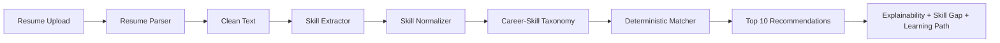

# AI Career Recommendation Platform

> Parse resume → extract skills → rank careers → explain match → close skill gaps.

[](https://gandharr.github.io/ai-career-platform/)
[](https://ai-career-platform-api.onrender.com/docs)
[](https://www.python.org/)
[](LICENSE)

An internship-ready full-stack platform that gives **deterministic**, skill-grounded career recommendations from uploaded resumes.

## Live Demo
- 🌐 Frontend: [https://gandharr.github.io/ai-career-platform/](https://gandharr.github.io/ai-career-platform/)
- ✅ Backend Health: [https://ai-career-platform-api.onrender.com/health](https://ai-career-platform-api.onrender.com/health)
- 📘 Swagger: [https://ai-career-platform-api.onrender.com/docs](https://ai-career-platform-api.onrender.com/docs)

## Screenshots

### Dashboard


### API Docs


## ✨ Key Highlights
- Resume parsing for `.pdf`, `.docx`, `.txt`
- NLP-style dictionary-based skill extraction
- Deterministic ranking (no random suggestions)
- Top **10** recommendations with matched skills and score
- Explainability + skill-gap + learning path
- Clean flow: **Login → Upload → Profile → Recommendations → Gap → Learning**

## Recommendation Pipeline

### 1) Resume Text Extraction
- Extract text from PDF, DOCX, TXT
- Normalize to lowercase, clean symbols, normalize whitespace

### 2) Skill Extraction
- Build dictionary from taxonomy + domain skill seeds
- Detect exact and synonym-mapped skills from cleaned text

### 3) Career–Skill Mapping Dataset
- Structured role-to-skills mapping in `backend/app/data/taxonomy.py`
- Covers CS, Business, Arts, Pharmacy, and more

### 4) Career Matching Algorithm
For each role:
- `matched = user_skills ∩ role_required_skills`
- `match_ratio = |matched| / |required|`
- `cosine = |matched| / sqrt(|user| * |required|)`
- `final_score = 0.65 * cosine + 0.35 * match_ratio`

### 5) Output
- Sort by score (descending)
- Return top **10** careers with deterministic order

## Architecture



## Tech Stack

| Layer | Tools |
|---|---|
| Frontend | React, Vite, Tailwind CSS, Recharts, jsPDF |
| Backend | FastAPI, SQLAlchemy, RapidFuzz, pdfplumber, python-docx |
| Data | PostgreSQL, MongoDB |
| Auth | JWT Bearer |
| Deployment | GitHub Pages + Render |

## Project Structure
- `frontend/` → dashboard UI, auth, charts, PDF export
- `backend/app/main.py` → API routes/orchestration
- `backend/app/services/resume_parser.py` → text + skill extraction
- `backend/app/services/recommender.py` → deterministic recommendation logic
- `backend/app/services/xai.py` → matched/missing explanation
- `backend/app/services/skill_gap.py` → missing-skill priority report
- `backend/app/data/taxonomy.py` → role-skill mapping dataset

## Quick Start

### Docker (Recommended)
```bash
cd ai-career-platform
docker compose up --build
```

- Frontend: `http://localhost:5173`
- Backend docs: `http://localhost:8000/docs`

### Manual Setup

#### Backend
```bash
cd backend
pip install -r requirements.txt
uvicorn app.main:app --reload
```

#### Frontend
```bash
cd frontend
npm install
npm run dev
```

## API Endpoints
- `POST /auth/register`
- `POST /auth/login`
- `POST /parse-resume`
- `POST /recommend-careers`
- `POST /skill-gap`
- `POST /learning-path`
- `GET /user/profile` *(protected)*

## Environment Variables

### Backend
- `POSTGRES_URL`
- `MONGO_URL`
- `MONGO_DB_NAME`
- `SECRET_KEY`
- `CORS_ORIGINS`

### Frontend
- `VITE_API_URL`

## Demo Scripts (PowerShell)

```powershell
./scripts/demo.ps1
./scripts/cleanup.ps1
```
